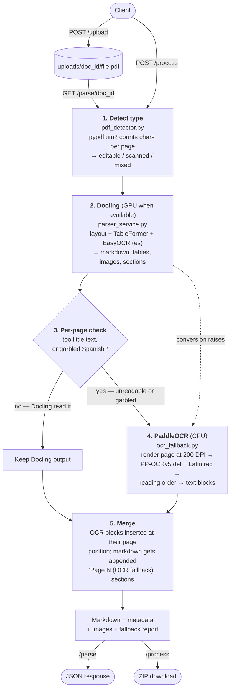

# WSLA Document Parsing API


## Architecture



| Stage | File | What it does |
| --- | --- | --- |
| Detect | `pdf_detector.py` | Counts text characters per page with pypdfium2; classifies the document `editable`, `scanned` or `mixed` |
| Parse | `parser_service.py` | Runs Docling, extracts tables/images/paragraphs/sections, orchestrates the fallback |
| Fallback | `ocr_fallback.py` | Renders unreadable pages and re-reads them with PaddleOCR |
| Schemas | `models.py` | Pydantic request/response models, including the fallback report |
| Settings | `config.py` | All tunables, via `WSLA_`-prefixed environment variables |
| API | `app.py` | The endpoints |
| Build | `download_paddle_models.py` | Warms the PaddleOCR models at image build time |

---

## Pipeline steps

Six steps, from uploaded PDF to returned Markdown.

### Step 1 — Take the file in and give it an id

**What we do:** accept a PDF upload, reject anything invalid, and store it under
an id the caller can refer to later.

**How:**
- `app.py` → `upload_pdf()` checks the filename ends in `.pdf`, rejects empty
  files, and rejects anything over `WSLA_MAX_FILE_SIZE` (100 MB)
- generates a `uuid4()` as the `doc_id`
- writes the bytes to `uploads/{doc_id}/{original_name}.pdf`

**Result:** `{"doc_id": "...", "filename": "...", "file_size": 123}`.
With `/process` the same thing happens internally, and the id is never returned.

### Step 2 — Work out whether the PDF already contains text

**What we do:** find out if this is a digital PDF or a scan, because that decides
whether any OCR is needed at all.

**How:**
- `pdf_detector.py` → `detect_pdf_type()` opens the file with `pypdfium2`
- for each page it calls `text_page.count_chars()` — just counting the text
  already embedded in the file, with no rendering and no models (~15 ms for 14 pages)
- a page with 50+ characters is `editable`, below that it is `scanned`
  (`WSLA_EDITABLE_CHAR_THRESHOLD`)
- all pages editable → `editable`; none → `scanned`; a mix → `mixed`

**Result:** the document type plus a per-page breakdown (`page_no`, `char_count`,
`classification`). This is information for the caller — it does not switch the
pipeline, because Docling decides region by region what needs OCR.

### Step 3 — Parse the document with Docling

**What we do:** turn the PDF into a structured document — headings, paragraphs,
tables, figures — reading scanned pages with OCR where there is no text.

**How:**
- `parser_service.py` → `_build_converter()` configures Docling:
  device from `WSLA_DEVICE` (`cuda` or `cpu`), `do_ocr=True`,
  `EasyOcrOptions(lang=["es"])` for Spanish, pictures exported at 144 DPI
- `parse_pdf()` calls `converter.convert(pdf_path)`
- inside Docling: each page is rendered → the **layout model** marks regions
  (heading, paragraph, figure, table) → **EasyOCR** reads any region with no
  embedded text → **TableFormer** works out the rows and columns of table regions
- `document.export_to_markdown()` produces the Markdown

**Result:** a structured document plus its Markdown. Because OCR happens *here*,
inside the layout, tables on scanned pages come out with real content instead of
empty shells.

*If Docling throws, we catch it, mark every page as unreadable, and let step 5
carry the document. If that is not possible, the original error is re-raised.*

### Step 4 — Pull out the metadata

**What we do:** convert Docling's document into flat lists our API can return and
other systems can consume.

**How:** `_extract_metadata()` makes two passes:
- **tables** — each one exported three ways (CSV, HTML, Markdown) through a pandas
  dataframe, with its row/column counts
- **everything else** — `document.iterate_items()` walks the body in reading order:
  a picture is saved as `{stem}-picture-N.png`, a section header becomes a section
  entry with its level, and any other text becomes a paragraph carrying Docling's
  own label (`text`, `list_item`, `caption`, `footnote`, …)
- every item records its page number from `prov[0].page_no`

**Result:** `tables`, `images`, `paragraphs` and `sections`. The page numbers are
what make step 5 possible.

### Step 5 — Check each page, and re-read the bad ones with PaddleOCR

**What we do:** find pages Docling failed to read and give them a second chance
with a different OCR engine.

**How:**
- `_page_text()` gathers, per page, the text Docling produced across paragraphs,
  sections and tables
- a page is **weak** on either of two signals:
  - **too little text** — fewer alphanumeric characters than
    `WSLA_FALLBACK_MIN_CHARS_PER_PAGE` (50). Punctuation and table pipes are
    excluded, so an empty table skeleton cannot look like text.
  - **garbled text** — the page is full of characters, but its accented-character
    rate is below `WSLA_FALLBACK_MIN_ACCENT_RATE` (0.8%), which is how a bad
    embedded OCR layer gives itself away (`text_quality.py`)
- every page is weak if Docling failed in step 3
- no weak pages means PaddleOCR is never even loaded, so this costs nothing
- for each weak page, `ocr_fallback.run_fallback()`:
  1. **renders** the page at 200 DPI (`WSLA_FALLBACK_DPI`) with `pypdfium2`
  2. **reads** it with PP-OCRv5 detection + the Latin recogniser, dropping lines
     under 0.5 confidence
  3. **reorders** the lines — PaddleOCR returns them in detection order, so lines
     at the same height are grouped into a row and read left to right, and a gap
     taller than one line starts a new block
  4. **keeps it only if it beats Docling** — for a low-yield page that means more
     characters, and the text is added to the page; for a garbled page the two
     texts are scored on length *and* accent rate, and the loser is removed so the
     page never carries both versions

**Result:** the recovered text per page, plus a report saying which pages were
weak, which were retried, how much was recovered, and the OCR confidence — so a
rescue is never invisible.

### Step 6 — Put it back together and send it out

**What we do:** merge the rescued text into the document and return the result.

**How:**
- `_merge_recovered_text()` inserts each recovered block into the paragraph list
  **at its own page's position** (labelled `ocr_fallback`) and re-indexes the
  list, so paragraphs stay in page order
- the same text is appended to the Markdown as `## Page N (OCR fallback)`
  sections — Docling's Markdown has no page markers, so inserting mid-document
  is not reliable; Docling's own text is never overwritten
- the run is labelled: `docling` (no rescue needed), `docling+paddleocr`
  (some pages rescued), or `paddleocr` (Docling failed entirely)
- the Markdown file is written, and `app.py` assembles the response

**Result:** JSON for `/parse`, or a ZIP for `/process` containing the Markdown,
`metadata.json`, `performance.json` and the images. Every stage is timed, and the
timings appear in `performance.json` and in the terminal summary.

---

## Endpoints

| Method | Path | Purpose |
| --- | --- | --- |
| `GET` | `/` | Health check; reports which engines are available |
| `POST` | `/upload` | Store a PDF, return a `doc_id` |
| `GET` | `/parse/{doc_id}` | Detect + parse; returns full JSON (markdown, metadata, fallback report). Cached — add `?refresh=true` to re-parse |
| `POST` | `/process` | Upload + detect + parse + stream back a ZIP, in one call |
| `GET` | `/status/{doc_id}` | Whether a document is uploaded and/or parsed, with its type and engine (read from the document store) |

`GET /` response:

```json
{
  "status": "ok",
  "service": "WSLA Document Parsing API",
  "engines": { "docling": true, "paddleocr": true },
  "ocr_fallback_enabled": true
}
```

The `/process` ZIP contains:

```
{pdf_stem}/
├── {pdf_stem}.md        full parsed markdown
├── metadata.json        tables, images, paragraphs, sections,
│                        parse_engine, fallback report, metrics
├── performance.json     per-stage timing and throughput
└── images/              extracted pictures as PNG
```

---

## How the fallback behaves

**It triggers in two cases:**

1. **Low yield** — a page produced fewer than `WSLA_FALLBACK_MIN_CHARS_PER_PAGE`
   alphanumeric characters across its paragraphs, sections and tables — i.e.
   pages EasyOCR could not read either.
2. **Poor quality** — the page is *full* of text, but the text reads as garbled
   Spanish: its accented-character rate is below
   `WSLA_FALLBACK_MIN_ACCENT_RATE` (0.8%). This catches scans carrying a bad
   embedded OCR layer, which a character count can never detect. See
   `text_quality.py` for the measured thresholds.
3. **Docling failure** — `convert()` raised. Every page is then handed to
   PaddleOCR and `parse_engine` becomes `paddleocr`. If the fallback cannot run,
   the original Docling error is re-raised.

**What it does with the text:**

- For a **low-yield** page, OCR text is kept only if PaddleOCR read **more**
  characters than Docling did, and it is *added* to the page.
- For a **poor-quality** page, the two texts are compared on quality (length plus
  accent rate) and the better one wins. Because Docling's text was wrong rather
  than missing, the loser is **removed** — from the metadata and from the
  markdown — so the page never shows both versions.
- Recovered blocks are inserted into `metadata.paragraphs` **at their page
  position** with `label: "ocr_fallback"`, so paragraphs stay in page order for
  downstream chunking.
- Docling's markdown has no page anchors, so rescued pages are **appended** as
  `## Page N (OCR fallback)` sections rather than spliced into the middle.
- Docling's own output is never discarded.

**`parse_engine`** is one of `docling`, `docling+paddleocr`, or `paddleocr`.

**The fallback never takes the service down.** If `paddleocr` is not installed
the API still starts, `GET /` reports `paddleocr: false`, and parsing is
Docling-only.

**Fallback report** (on `/parse` responses and in `metadata.json`):

```json
{
  "enabled": true, "available": true, "triggered": true,
  "reason": "low_yield", "skipped_reason": null, "docling_error": null,
  "threshold": 50, "weak_pages": [2], "pages_skipped": [],
  "pages_attempted": 1, "pages_recovered": 1, "chars_recovered": 1082,
  "seconds": 6.18,
  "pages": [{ "page_no": 2, "reason": "low_yield", "docling_chars": 0,
              "char_count": 1082, "line_count": 81, "mean_confidence": 0.99,
              "recovered": true, "seconds": 4.5, "error": null }]
}
```

---

## Configuration

Every setting is an environment variable with the `WSLA_` prefix.

| Variable | Default | Purpose |
| --- | --- | --- |
| `WSLA_DEVICE` | `auto` | `auto` (GPU when visible, else CPU), `gpu`, or `cpu` — drives Docling **and** EasyOCR |
| `WSLA_PADDLE_DEVICE` | `cpu` | Device for the PaddleOCR fallback (see note below) |
| `WSLA_UPLOAD_DIR` | `./uploads` | Where uploaded PDFs are stored |
| `WSLA_OUTPUT_DIR` | `./output` | Where markdown and images are written |
| `WSLA_MAX_FILE_SIZE` | `104857600` | Upload limit in bytes (100 MB) |
| `WSLA_EDITABLE_CHAR_THRESHOLD` | `50` | Chars/page for the editable-vs-scanned **classification** |
| `WSLA_IMAGE_RESOLUTION_SCALE` | `2.0` | Docling picture export scale (2.0 = 144 DPI) |
| `WSLA_ENABLE_OCR_FALLBACK` | `true` | Master switch for the PaddleOCR fallback |
| `WSLA_FALLBACK_MIN_CHARS_PER_PAGE` | `50` | Alphanumeric chars/page below which a page is **weak** |
| `WSLA_FALLBACK_DPI` | `200` | Render resolution for fallback OCR |
| `WSLA_ENABLE_QUALITY_TRIGGER` | `true` | Re-OCR pages whose text reads as garbled |
| `WSLA_FALLBACK_MIN_ACCENT_RATE` | `0.008` | Below this accent rate a page counts as garbled |
| `WSLA_QUALITY_MIN_LETTERS` | `60` | Pages shorter than this are never quality-judged |
| `WSLA_ENABLE_COLUMN_SPLIT` | `true` | Detect columns before ordering OCR lines |
| `WSLA_COLUMN_GUTTER_RATIO` | `0.06` | Gap width (of page width) that separates columns |
| `WSLA_PADDLE_MAX_PAGES` | `0` | Cap on rescued pages per document (0 = no limit) |
| `WSLA_PADDLE_MIN_CONFIDENCE` | `0.5` | Recognised lines below this are dropped |
| `WSLA_PADDLE_DET_MODEL` | `PP-OCRv5_mobile_det` | Text detection model |
| `WSLA_PADDLE_REC_MODEL` | `latin_PP-OCRv5_mobile_rec` | Recognition model (Latin covers Spanish) |
| `WSLA_PADDLE_MODEL_DIR` | `/opt/paddle/official_models` in the image | Pre-downloaded models, laid out `<dir>/<model_name>/` |
| `WSLA_PADDLE_USE_TEXTLINE_ORIENTATION` | `true` | Correct rotated text lines |
| `WSLA_PADDLE_CPU_THREADS` | `4` | Inference threads |
| `WSLA_PADDLE_ENABLE_MKLDNN` | `true` | oneDNN acceleration on CPU |

The two thresholds are separate: `WSLA_EDITABLE_CHAR_THRESHOLD` classifies the
document for reporting, while `WSLA_FALLBACK_MIN_CHARS_PER_PAGE` decides which
pages get re-OCR'd after Docling has run.

### Device selection

`WSLA_DEVICE` accepts `auto`, `gpu` or `cpu`. `auto` uses CUDA when a GPU is
visible and CPU otherwise; `gpu` fails loudly when no GPU is present. It controls
Docling's layout model, TableFormer and EasyOCR together.

**The PaddleOCR fallback always runs on CPU.** PaddlePaddle 3.x GPU wheels are
published only on paddlepaddle.org.cn, which our network cannot reach, and PyPI's
`paddlepaddle-gpu` stops at 2.6.2 — too old for `paddleocr` 3.7. Since the fallback
only touches pages EasyOCR failed on, this costs little in practice.

---

## Running

`PORT` is required — the app exits if it is unset.

```bash
echo "PORT=7860" > .env
docker compose up --build
curl http://localhost:7860/
```

`docker-compose.yml` reserves every NVIDIA GPU the host exposes. On a machine
without one, use the CPU override:

```bash
docker compose -f docker-compose.yml -f docker-compose.cpu.yml up
```

The first build is long — roughly 1.5–2 hours on a ~1.3 MB/s connection, most of it
downloading CUDA-enabled PyTorch (~3 GB of wheels) and the models. Later builds
reuse the cached layers.

Send a document through the whole pipeline:

```bash
curl -X POST -F "file=@your.pdf" http://localhost:7860/process -o parsed.zip
```

Or step by step:

```bash
DOC=$(curl -s -X POST -F "file=@your.pdf" http://localhost:7860/upload | jq -r .doc_id)
curl -s "http://localhost:7860/parse/$DOC" | jq '.parse_engine, .fallback'
```

### Local development

```bash
pip install "docling[standard]" "docling-slim[feat-ocr-easyocr]"
pip install paddlepaddle==3.2.0          # CPU build from PyPI
pip install -r requirements.txt
PORT=7860 python app.py
```

---

## Models and offline operation

The image is built in two stages. The builder downloads every model; the runtime
stage copies them in, so **the container never downloads models at start-up**:

- **Docling** — layout + TableFormer → `/opt/docling/models`
- **EasyOCR** — CRAFT detector + `latin_g2` recogniser (Spanish) →
  `/opt/docling/models/EasyOcr`, prefetched with
  `docling-tools models download easyocr --easyocr-lang es`
- **PaddleOCR** — PP-OCRv5 detection, Latin recognition, text-line orientation →
  `/opt/paddle/official_models`, warmed by `download_paddle_models.py`

All come from HuggingFace / GitHub. When `DOCLING_ARTIFACTS_PATH` is set and
`model_storage_directory` is left unset, Docling points EasyOCR at the baked-in
files and **disables downloading**. Verified by running the container with
`--network none`: a full 14-page scanned document parsed with no network at all.

### Why EasyOCR, and not RapidOCR

Docling supports four local OCR engines. RapidOCR — the original choice here — is
unusable on this network:

| Engine | Spanish | Models reachable? |
| --- | --- | --- |
| **EasyOCR** (in use) | `es` → `latin_g2` | Yes — GitHub / jaided.ai |
| RapidOCR | a `latin` set exists | **No** — all 291 URLs point at ModelScope, which times out |
| Tesseract | `spa` apt package | Yes, but weaker on noisy scans |
| Kserve / Nemotron | n/a | Remote OCR services |

RapidOCR also defaulted to `lang=['chinese']` in the original configuration, so
Spanish was never actually selected.

EasyOCR has a second advantage: it is CRAFT + CRNN, a different architecture from
PaddleOCR's PP-OCRv5. RapidOCR *is* PaddleOCR converted to ONNX, so pairing it
with the PaddleOCR fallback would mean both engines failing on the same pages.

---

## Verified results

Measured in the container on an RTX 4050 Laptop (6 GB VRAM), torch 2.14.0+cu126:

| Document | Pages | Type | Engine | Docling | PaddleOCR | Total |
| --- | --- | --- | --- | --- | --- | --- |
| WLA RPT PYME_Mar2012 | 14 | scanned | `docling` | 49.7s | not needed | **52s** |
| WLA_Portal WAP Ideas Telcel | 14 | scanned | `docling+paddleocr` | 56.7s | 19.2s (3 pages) | **79s** |
| WLA_Mensajeria Corporativa_Final | 9 | editable | `docling` | 29.3s | not needed | **31s** |

- **Tables are populated on scanned pages**: 8 tables / 24,692 chars (PYME),
  10 tables / 16,601 chars (Portal), 7 tables / 17,818 chars (Mensajeria) — none
  empty. This works only because Docling does the OCR itself, giving TableFormer
  text cells to fill.
- **The fallback behaves like a fallback**: on Portal WAP it rescued only pages
  6, 8 and 14 rather than the whole document.
- Versions inside the image: numpy 2.3.5, docling 2.126.0, paddlepaddle 3.2.0,
  paddleocr 3.7.0. Image size **15.6 GB** (CUDA wheels account for ~9 GB).

### GPU vs CPU

Same document, idle machine, back to back:

| Device | Time |
| --- | --- |
| CPU (`WSLA_DEVICE=cpu`) | 190.2s |
| GPU (`WSLA_DEVICE=auto`) | **61.0s** |
| | **3.1× faster** |

---

## Performance

| Operation | Time |
| --- | --- |
| Docling + EasyOCR, per page (GPU) | ~3.5 s |
| Docling + EasyOCR, per page (CPU) | ~13 s |
| PaddleOCR fallback, per page (CPU) | ~3 s |
| PaddleOCR engine load | ~2.3 s, once per process |

The PaddleOCR engine is a lazy, lock-guarded singleton: it loads on first use and
inference is serialised, so concurrent requests do not each pay the load cost.
Docling caches its models at process level, so building a converter per request
costs nothing measurable after the first parse.

`/process` prints a per-stage breakdown with PaddleOCR as its own row, and writes
the same figures to `performance.json`.

---

## Known limitations

These are the ones that remain, and why.

- **The PaddleOCR fallback cannot use the GPU.** PaddlePaddle 3.x GPU wheels are
  published only on paddlepaddle.org.cn, which this network cannot reach, and
  PyPI's `paddlepaddle-gpu` stops at 2.6.2 — too old for `paddleocr` 3.7. Docling
  and EasyOCR do run on the GPU. Since the fallback only touches pages EasyOCR
  failed on, the cost is small. On a network that can reach that host, set
  `WSLA_PADDLE_DEVICE=gpu` and install `paddlepaddle-gpu` instead.
- **EasyOCR reads fewer accents than PaddleOCR.** Document-level accent rates are
  1.59% and 1.90% against PaddleOCR's 2.02% and 2.40%. The quality trigger
  catches *garbled* pages (below 0.8%), not merely *imperfect* ones, because
  flagging every page would send the whole document through PaddleOCR at ~3 s per
  page. If accent fidelity matters more than speed, raise
  `WSLA_FALLBACK_MIN_ACCENT_RATE` towards 0.015 — the page is only replaced when
  PaddleOCR actually scores better, so this costs time, not correctness.
- **Column splitting needs a clean gutter.** Text in two columns is now read
  column by column, but a flowchart whose boxes overlap horizontally has no clear
  gutter, so those lines can still interleave.
- **The image is large (~15 GB).** The unused `rapidocr` extra is gone, but ~430 MB
  of NCCL and nvshmem ship inside the PyTorch layer; they matter only for
  multi-GPU/multi-node setups. Removing them means rebuilding that layer, which
  re-downloads ~3 GB of CUDA wheels — worth doing on a fast connection, not for a
  3% saving here. Add to the torch step when you do:
  `&& pip uninstall -y nvidia-nccl-cu12 nvidia-nvshmem-cu12`
- **Cached parses can go stale.** `/parse/{id}` returns the stored result; if the
  PDF is replaced under the same id, pass `?refresh=true`.
- **No job queue.** `/process` no longer blocks the event loop, but a long parse
  still occupies a worker thread; there is no queue, priority or progress API.

### Fixed in this version

| Was | Now |
| --- | --- |
| A garbled embedded text layer slipped through | Quality trigger re-OCRs pages whose accent rate falls below 0.8% |
| Rescued pages could show Docling's wrong text *and* the correction | Poor-quality pages are replaced, in metadata and markdown |
| Side-by-side columns interleaved | Lines are split into columns along vertical gutters, read column by column |
| `/process` blocked the event loop | Runs as `def`, so FastAPI executes it in a worker thread |
| `/parse` re-parsed on every call | Result cached to `parse_result.json`; `?refresh=true` forces a re-parse |
| `/status` re-read the PDF to report its type | Served from the SQLite document store |
| `metadata.json` reported `total: 0.0` | JSON reports are written after the totals are computed |
| State was filesystem-only | `storage.py` keeps a SQLite record of every document |
| Tables on scanned pages were empty | Docling does the OCR, so TableFormer gets text cells |
